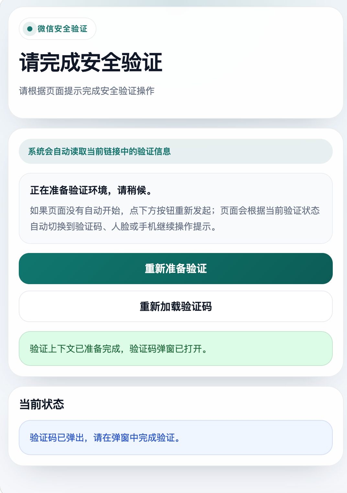
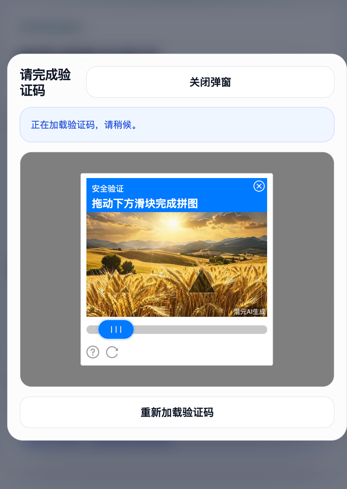
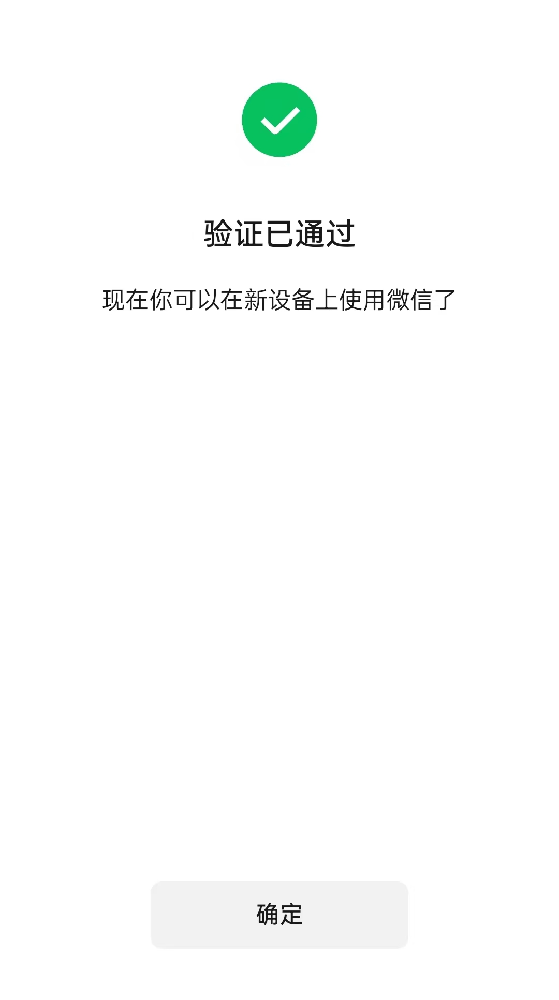

# Mac 微信安全验证人工滑块方案与 UUID 研究


**交流学习联系**

**WeChat:** **`RSCompanyCEO`**

**Telegram:** **`ryf5584`**

**QQ:** **`1043695584`**

## 这个方向是干什么的

这篇文档主要记录一个很实际的方向: 在微信 iPad 协议登录研究里，已经把网页人工完成 PIN 验证和人工通过滑块验证这条链路整理出来，并最终用于承接 Mac 微信需要安全验证的场景。

很多人外部会直接搜两个问题:

- 微信iPad协议过验证
- 微信协议登录安全验证需要UUID

这篇公开研究就是围绕这两个问题来写的。大白话说，扫码以后如果没有直接登录成功，而是继续进入安全验证，那么网页侧想把人工滑块、验证码、PIN 这一段真正接起来，就不能只停留在页面展示层，还必须把后续请求依赖的 `uuid` 一起补齐。

而这次研究里比较关键的公开结论就是:

- 提交验证码和后续安全验证请求用到的 `uuid`，本质上就是这一段研究里持续追踪的 `mmsf0001 / securityInfo`
- 只把验证页打开还不够，真正能不能把验证做完，核心取决于页面交互和协议安全上下文能不能接上
- 这也是为什么很多人会觉得“页面已经有了，但还是过不了验证”

## 它最终是为了解决什么事情

这个方向最终解决的是:

- 微信 iPad 协议扫码登录后，遇到 Mac 微信安全验证时，如何通过网页侧人工完成滑块、验证码、PIN 等动作，并把结果继续传回后续登录链路

如果不把这件事拆清楚，常见问题就会一直卡在这里:

- 扫码以后不是直接登录，而是跳到安全验证
- 网页虽然能打开，但只会展示，不会真正承接后续提交
- 人工把滑块拖完以后，协议侧缺少关键上下文，提交还是走不下去
- PIN 页面出来以后，如果没有正确的 `uuid`，后续请求依然无法稳定联调

所以这篇文档真正想说清楚的不是“做了一个页面”，而是:

- 微信 iPad 协议过验证，到底卡在页面交互，还是卡在协议安全参数
- 为什么微信协议登录安全验证需要 UUID
- 为什么这个 UUID 不是普通网页里随便拼一个值就能顶替
- 把这块补齐以后，Mac 微信安全验证链路才能真正继续往后走

## 研究思路

这个方案的研究思路，公开层面可以拆成下面四步:

1. 先把“网页能显示验证页”和“协议能提交验证结果”这两件事拆开
2. 再确认滑块、验证码、PIN 提交这几段请求到底依赖什么安全上下文
3. 然后单独梳理 `mmsf0001 / securityInfo / uuid` 在这一段里的承接关系
4. 最后把网页人工验证能力和协议登录上下文接起来，形成可继续联调的方案

换成更直白的结构示意，就是:

```text
二维码登录上下文 + mmsf0001(uuid) + 网页人工滑块/验证码/PIN + 验证通过结果 -> 继续登录检查
```

这条研究路线的重点，不是公开具体实现，而是先确认问题本质:

- 如果只盯着页面，就会误以为验证失败是前端交互问题
- 如果只盯着协议包，又会忽略人工验证页面本身的承接方式
- 真正的难点是两边要同时成立: 页面能操作，协议也有可用的 `uuid`

## 为什么说微信协议登录安全验证需要 UUID

这是这次研究里最值得单独拿出来讲清楚的一点。

很多人说“微信协议登录安全验证需要UUID”，本质上是在说:

- 安全验证页后续提交请求，并不是只靠验证码文本或滑块结果就能完成
- 这一段请求还依赖一个和客户端安全上下文绑定的 `uuid`
- 在当前研究结论里，这个 `uuid` 可以对应理解为 `mmsf0001 / securityInfo` 这一类安全载荷
- 没有它，人工验证动作就只能停留在页面层，不能稳定承接到协议登录流程

所以从公开角度可以把它理解成:

```text
人工验证动作 = 页面交互
真正可提交的安全验证 = 页面交互 + uuid(mmsf0001/securityInfo)
```

这也是为什么“微信协议登录安全验证需要UUID”这句话并不是营销话术，而是一个很实际的链路前提。

## 现在已经能做到什么

现阶段，这个方向已经落到比较明确的结果级结论:

- 已经能把网页人工完成滑块验证、验证码确认、PIN 提交这一段整理成可承接的方案
- 已经能把 `mmsf0001 / securityInfo` 作为这一段提交所需 `uuid` 的核心前置能力来准备
- 已经能在 Mac 微信需要安全验证的场景下，把人工验证动作继续接到后续登录流程
- 已经能把“页面展示能力”和“协议承接能力”拆开分析，不再混在一起排查
- 已经能把这套方向整理成前后端可对接的能力模块，而不只是一次性调试

如果用更接地气的话总结，就是:

- 不是只会打开验证页
- 不是只会抓页面参数
- 而是已经能把人工过验证这件事真正接进微信 iPad 协议登录链路

## 公开示意

下面只放公开层面的结构示意和页面效果，不放关键实现。

### Go 结构示意

```go
type ManualVerifyContext struct {
    VerifyID   string
    UUID       string
    Scene      string
    DeviceType string
}

type ManualVerifyResult struct {
    Success      bool
    VerifyState  string
    NextStep     string
    Tips         []string
}

func BuildManualVerifyContext(ctx ManualVerifyContext) (*ManualVerifyResult, error) {
    // 1. 读取二维码登录上下文
    // 2. 准备本次安全验证需要的 uuid
    // 3. 承接网页人工滑块/PIN 结果
    // 4. 继续推进后续登录检查
    return &ManualVerifyResult{}, nil
}
```

### 返回格式示意

```json
{
  "Code": 0,
  "Success": true,
  "Message": "success",
  "Data": {
    "verifyId": "VERIFY_xxxxx",
    "uuid": "URLENCODED_SECURITY_INFO_xxxxx",
    "verifyState": "manual-finished",
    "nextStep": "continue-login-check",
    "warnings": [
      "manual slider required",
      "pin verify enabled"
    ]
  }
}
```

这个公开示意想表达的重点是:

- `verifyId` 用来标识这次安全验证上下文
- `uuid` 是后续提交动作真正依赖的安全参数之一
- 人工操作做完以后，还要回到协议链路继续承接结果

### 页面示意

下面三张图放的是公开页面效果和人工验证结果示意，GitHub 可直接通过相对路径展示:

#### 手动提交验证码页面



#### 验证码图片示意



#### 手机微信提示验证通过



## 微信 iPad 协议过验证的实际价值

如果外部关心的是“微信 iPad 协议过验证”到底意味着什么，这里的公开答案很直接:

- 遇到安全验证时，不再只是卡在扫码成功但登录中断的状态
- 可以把人工滑块、验证码、PIN 这几段变成可承接的真实流程
- 可以把 `mmsf0001 / uuid` 这类安全参数整理成稳定前置能力
- 可以让 Mac 微信需要安全验证的场景继续推进，而不是只能停在分析阶段

对合作方来说，这项能力的价值主要体现在:

- 可以用于微信 iPad 协议过验证相关方案评估
- 可以用于微信协议登录安全验证需要 UUID 的场景对接
- 可以用于需要网页人工接手滑块/PIN 的验证承接方案
- 可以用于把原本分散的验证能力整理成前后端协同模块

## 适用用途

- 微信 iPad 协议登录安全验证研究
- Mac 微信安全验证场景承接
- 人工滑块、验证码、PIN 验证流程接手
- `mmsf0001 / securityInfo / uuid` 关系整理
- 面向合作方展示“微信 iPad 协议过验证”能力边界与落地价值

## 公开边界

这篇文档只公开:

- 这个方案解决什么问题
- 公开层面的研究思路
- 当前已经能做到什么程度
- 页面示意与对外合作价值

这篇文档不公开:

- 关键源码
- 核心参数明文
- 可直接复现的提交流程细节
- 可直接交付第三方使用的敏感实现
- 关键样本与关键协议细节

## 后续方向

后续还可以继续围绕下面几个方向更新:

- 不同设备环境下 `uuid / mmsf0001` 的差异
- 不同验证分支下人工接手页面的统一承接方式
- 自动验证与人工验证之间的切换策略
- 微信 iPad 协议登录更完整的安全验证闭环整理
